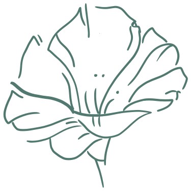

<h1  align="center">
  
  &nbsp;Portfolio - Matthieu Munoz
  
</h1>

<p align="center">
  <a href="https://matthieu-munoz.fr">
  
  </a>
</p>

<p align="center">
  <a href="https://matthieu-munoz.fr">Live Version
  </a>
</p>

## Bienvenue ! 👋

Voici mon portfolio, il évoluera avec le temps en regroupant la présentation de mes compétences mais aussi mes projets.

## Réalisation

### Une maquette

Avant de me lancer dans le code, j'ai commencé par poser une maquette Figma de ce que je voulais obtenir. C'est non seulement une préférence mais aussi une contrainte personnelle, étant [aphantasique](https://aphantasiaclub.org) mon process de création implique un support physique, j'ai donc besoin de voir un "résultat" (croquis, wireframe ou maquette), afin de pouvoir confirmer ou non mon idée initiale.

[Lien de la maquette Figma](https://www.figma.com/file/r6Zu7PGwID89jzda2hof5U/main-portfolio?node-id=0%3A1)

Une maquette c'est aussi une bonne manière pour moi de commencer la réflexion sur la structure de mon code. Je ne fais pas "juste" une représentation de ce que je veux obtenir car je prends bien en compte mes capacités et mes connaissances afin de créer une maquette que je saurais coder.

### Le code

J'ai fait le choix de mettre en pratique ma spécialisation en React.js.

#### Les technos/dépendances

**Les bases :**

- Yarn :  C’est un gestionnaire de packages qui se double d'un gestionnaire de projets. Utilisé en même temps que npm (node package manager), il me permet d’installer toutes les dépendances utiles au site. Celles-ci seront gérées depuis le fichier package.json.
- HTML/CSS/JS :  Les trois langages d’une page web. Ils seront utilisés à travers tout le site, parfois par des extensions syntaxiques comme JSX pour l’HTML/le JS ou alors avec une forme alternative comme le SCSS pour le CSS. La mise en production de notre site transpilera l’intégralité de mon code dans ce trio pour qu’il soit lisible par les navigateurs.
- Create React App (CRA) : C’est un package installé depuis npm. Il permet l’initialisation d’un projet React avec une configuration moderne testée, approuvée et maintenue.

**Les dépendances :**

- React : C’est une bibliothèque JavaScript créée par Facebook, elle sera la base de mon portfolio.
- Redux : C’est une bibliothèque JavaScript open-source pour gérer l'état de l'application. Redux est couramment utilisé avec React pour créer des interfaces utilisateur.
- React-redux : C’est la couche officielle de liaisons de l'interface utilisateur React pour Redux. Il permet à mes composants React de lire les données d'un magasin Redux et d'envoyer des actions au magasin pour actualiser le state.
- SASS : Nécessaire pour utiliser le SCSS, c’est un préprocesseur qui, comme Babel, traduira mon code en CSS lisible par les navigateurs.
- cloudinary-react : Permet de délivrer les images depuis le cdn Cloudinary
- dompurify : Permet de purifier de l'HTML avant l'insertion dans du JSX
- react-autosize-textarea : Donne accès à un composant text-area avec une hauteur automatique.
- cooltipz-css : Permet l'intégration rapide de bulle d'information tip 'tooltip'
- react-icons : Librairie d'icon donnant accès simplement à une multitude d'icon.
- react-scroll : Composant React pour animer le scroll vertical, utilisé pour l'animation de départ et le scroll de section.
- react-waypoint : Place un point d'ancrage n'importe où sur une page pour si rendre avec une petite fonction js.

#### Déploiement

Ce site est livré avec un fichier package.json déjà rempli, toutes les dépendances utilisées y sont donc configurées.

Pour déployer le site en local :

1. Cloner ce repo sur votre machine
2. Ouvrir un terminal dans le répertoire du site
3. Faire un `yarn` pour installer toutes les dépendances
4. Pour lancer un serveur de développement faire un `yarn start`
5. Pour consulter le code, ouvrir dans VSCode à partir du terminal avec un `code .`

Une fois le site déployé en local, on peut le déployer en ligne :

1. Dans un terminal à la racine du site, exécuter un `yarn build`. Cette commande va réaliser la compilation du code du site et créer un dossier `build` à la racine contenant une version déployable du site.
2. Dans le dossier du serveur (souvent `public` ou `public_html`) copier le contenu du dossier `build`.

#### Fonctionnalités supplémentaires

##### Craco

Create React App Configuration Override ( CRACO ) est une surcouche de configuration simple et compréhensible pour create-react-app.
Elle me permet de modifier des configurations interne à CRA autrement impossible à modifier.
Ici, j'ai créé un alias `@` correspondant au dossier `./src`, cela permet de facilement accéder au répertoire src depuis n'importe quel fichier.

##### SCSS Theming

J'ai aussi implémenté la fonctionnalité de theming SASS proposé par [@katiemctigue](https://medium.com/@katiemctigue/how-to-create-a-dark-mode-in-sass-609f131a3995).
Dans le fichier [_color-themes.scss](src/styles/_color-themes.scss), j'ai défini les différents éléments de notre thème dans la variable `$themes`.
L'accès à cette fonctionnalité est possible à tout moment dans un fichier SCSS avec :

```scss
@include color-themes.themed() {
        css-property: color-themes.ask("theme-var");
      }
```

## La suite

La prochaine étape de ce site sera donc le développement d'un serveur back.
